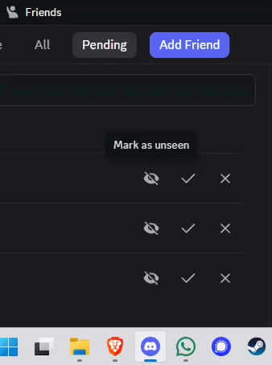

# HideSeenFriendRequests

A BetterDiscord plugin that lets you mark incoming pending friend requests as seen so they no longer contribute to Discord's pending friend request notification count.



## What It Does

- Adds an eye button to each visible incoming pending friend request row.
- Click the eye button to mark a request as seen.
- Seen pending requests are subtracted from Discord's pending friend request count.
- Click the button again to mark the request as unseen.
- Seen request IDs are saved locally through BetterDiscord data storage.

## Installation

1. Download `HideSeenFriendRequests.plugin.js`.
2. Move it into your BetterDiscord plugins folder:

   ```text
   %AppData%\BetterDiscord\plugins
   ```

3. Open Discord.
4. Go to `User Settings` > `BetterDiscord` > `Plugins`.
5. Enable `HideSeenFriendRequests`.

## Usage

Open Discord's pending friend requests view. Each incoming pending request should have a new eye icon next to the usual action buttons.

- Eye icon: mark the request as seen.
- Crossed-out eye icon: mark the request as unseen.

When a request is marked as seen, it remains in the pending requests list, but it no longer increases the pending friend request badge count.

## Local Data

The plugin stores seen pending request IDs in BetterDiscord's data storage under:

```text
HideSeenFriendRequests.config.json
```

If a request is no longer pending, the plugin ignores that saved ID when calculating the visible pending count.

## Compatibility

This plugin depends on Discord's internal relationship store and the current BetterDiscord API. Discord updates can change internal APIs or class names, so the plugin may need maintenance if the pending friend request UI changes.
